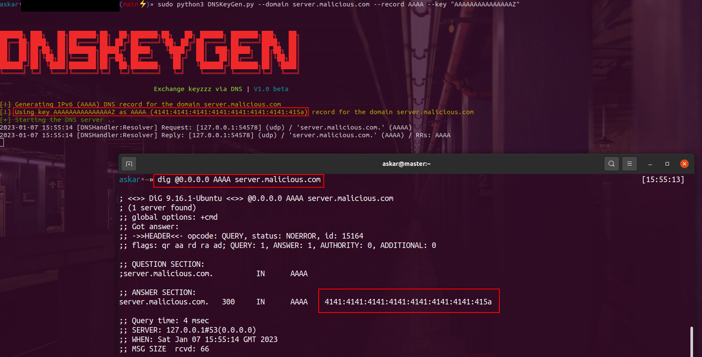

# DNSKeyGen 

DNSKeyGen is a Python-based open-source tool designed to facilitate the exchange of command and control (C2) beacon/implant decryption keys through DNS records, including A, AAAA, and TXT records.

This tool creates a DNS server that responds to requests for a specified domain by returning the requested decryption key in the response. The user has the option to specify a specific key or to have the tool generate one based on the DNS record being used.

# Installation

First of all, clone the latest DNSKeyGen repository like the following:
```
askar•~/DNSKeyGen(main)» git clone https://github.com/mhaskar/DNSKeyGen
```
Then Install all the required packages using `Poetry`. To install the required packages for DNSKeyGen using Poetry, you will need to have Poetry installed on your system. If you do not have Poetry installed, you can install it by running the following command:

```
pip3 install poetry
```

Once Poetry is installed, you can use it to install the required packages by navigating to the directory containing your DNSKeyGen project and running the following commands:

```
askar•~/DNSKeyGen(main)» cd DNSKeyGen
askar•~/DNSKeyGen(main)» poetry install

```


# Usage

To show all DNSKeyGen options you can use the flag `-h` like the following:

```
askar•~/DNSKeyGen(main)» sudo python3 DNSKeyGen.py -h                                                                                                                                   
usage: DNSKeyGen.py [-h] [--domain DOMAIN] [--record RECORD] [--key KEY] [--generatekey] [--tcp]

DNSKeyGen arguments parser

optional arguments:
  -h, --help       show this help message and exit
  --domain DOMAIN  The domain you want to use to host the key
  --record RECORD  The record you want to use (A, AAAA or TXT)
  --key KEY        The key you want to use as DNS response
  --generatekey    Generate random key to use
  --tcp            Use DNS over TCP
askar•~/DNSKeyGen(main)»                                                                                                                                                            
```

* -h or --help: Show the help message and a list of available options.
* --domain DOMAIN: Specify the domain that you want to use to host the key.
* --record RECORD: Specify the DNS record type that you want to use. Valid options are A, AAAA, and TXT.
* --key KEY: Specify the key that you want to use as the DNS response.
* --generatekey: Use this option to have DNSKeyGen generate a random key to use as the DNS response.
* --tcp: Use this option to use DNS over TCP instead of the default UDP.


**Note: Make sure to run DNSKeyGen as root.**

### Generate a key as AAAA record response for a specific domain

```
askar•~/DNSKeyGen(main)» sudo python3 DNSKeyGen.py --domain server.malicious.com --record AAAA --key "AAAAAAAAAAAAAAAZ"                                                         


    
██████╗ ███╗   ██╗███████╗██╗  ██╗███████╗██╗   ██╗ ██████╗ ███████╗███╗   ██╗
██╔══██╗████╗  ██║██╔════╝██║ ██╔╝██╔════╝╚██╗ ██╔╝██╔════╝ ██╔════╝████╗  ██║
██║  ██║██╔██╗ ██║███████╗█████╔╝ █████╗   ╚████╔╝ ██║  ███╗█████╗  ██╔██╗ ██║
██║  ██║██║╚██╗██║╚════██║██╔═██╗ ██╔══╝    ╚██╔╝  ██║   ██║██╔══╝  ██║╚██╗██║
██████╔╝██║ ╚████║███████║██║  ██╗███████╗   ██║   ╚██████╔╝███████╗██║ ╚████║
╚═════╝ ╚═╝  ╚═══╝╚══════╝╚═╝  ╚═╝╚══════╝   ╚═╝    ╚═════╝ ╚══════╝╚═╝  ╚═══╝

                                        Exchange keyzzz via DNS | V1.0 beta
                                                                              
[!] Generating IPv6 (AAAA) DNS record for the domain server.malicious.com
[!] Using key AAAAAAAAAAAAAAAZ as AAAA (4141:4141:4141:4141:4141:4141:4141:415a) record for the domain server.malicious.com
[+] Starting the DNS server ..
```

The following screenshot shows how you can host the key `AAAAAAAAAAAAAAAZ` as a `AAAA` response for the domain `server.malicious.com` and how we can confirm that it's working using `dig` command querying the local DNS server which is run by `DNSKeyGen`.



You can use it online by modifying your main domain Nameservers to point to DnsKeyGen to serve the requested records for you.


### Generate a key as A record response for a specific domain

```
askar•~/DNSKeyGen(main)» sudo python3 DNSKeyGen.py --domain server.malicious.com --record A --key "LOLZ"                                                                        


    
██████╗ ███╗   ██╗███████╗██╗  ██╗███████╗██╗   ██╗ ██████╗ ███████╗███╗   ██╗
██╔══██╗████╗  ██║██╔════╝██║ ██╔╝██╔════╝╚██╗ ██╔╝██╔════╝ ██╔════╝████╗  ██║
██║  ██║██╔██╗ ██║███████╗█████╔╝ █████╗   ╚████╔╝ ██║  ███╗█████╗  ██╔██╗ ██║
██║  ██║██║╚██╗██║╚════██║██╔═██╗ ██╔══╝    ╚██╔╝  ██║   ██║██╔══╝  ██║╚██╗██║
██████╔╝██║ ╚████║███████║██║  ██╗███████╗   ██║   ╚██████╔╝███████╗██║ ╚████║
╚═════╝ ╚═╝  ╚═══╝╚══════╝╚═╝  ╚═╝╚══════╝   ╚═╝    ╚═════╝ ╚══════╝╚═╝  ╚═══╝

                                        Exchange keyzzz via DNS | V1.0 beta
                                                                              
[!] Generating IPv4 (A) DNS record for the domain server.malicious.com
[!] Using key LOLZ as A record (76.79.76.90) for the domain server.malicious.com
[+] Starting the DNS server ..
```

### Generate a key as TXT record response for a specific domain

```
askar•~/DNSKeyGen(main)» sudo python3 DNSKeyGen.py --domain server.malicious.com --record TXT --key "PWN4LIFE"                                                                  [15:49:02]


    
██████╗ ███╗   ██╗███████╗██╗  ██╗███████╗██╗   ██╗ ██████╗ ███████╗███╗   ██╗
██╔══██╗████╗  ██║██╔════╝██║ ██╔╝██╔════╝╚██╗ ██╔╝██╔════╝ ██╔════╝████╗  ██║
██║  ██║██╔██╗ ██║███████╗█████╔╝ █████╗   ╚████╔╝ ██║  ███╗█████╗  ██╔██╗ ██║
██║  ██║██║╚██╗██║╚════██║██╔═██╗ ██╔══╝    ╚██╔╝  ██║   ██║██╔══╝  ██║╚██╗██║
██████╔╝██║ ╚████║███████║██║  ██╗███████╗   ██║   ╚██████╔╝███████╗██║ ╚████║
╚═════╝ ╚═╝  ╚═══╝╚══════╝╚═╝  ╚═╝╚══════╝   ╚═╝    ╚═════╝ ╚══════╝╚═╝  ╚═══╝

                                        Exchange keyzzz via DNS | V1.0 beta
                                                                              
[!] Generating TXT DNS record for the domain server.malicious.com
[!] Using key PWN4LIFE as TXT (PWN4LIFE) record for the domain server.malicious.com
[+] Starting the DNS server ..
```

# License

This project is licensed under the GPL-3.0 License - see the LICENSE file for details.

